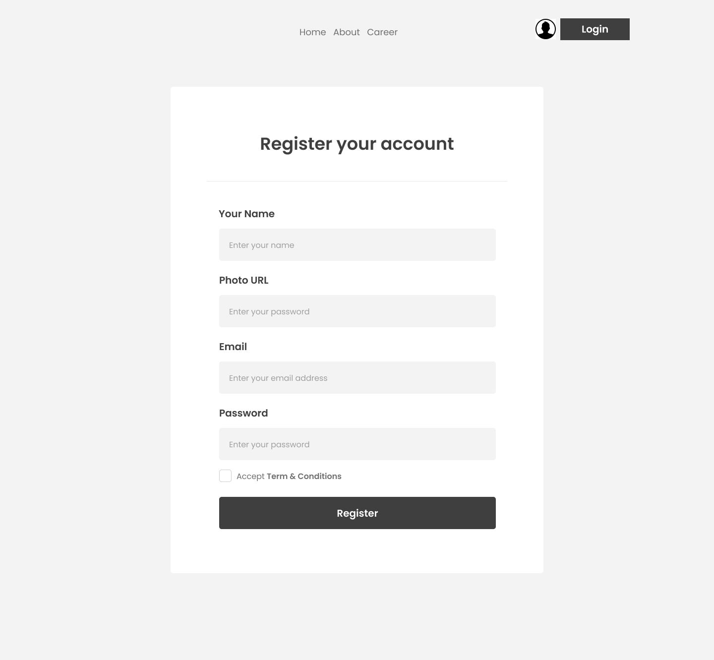

# A 48 Hours Full stack React JS newspaper project

# 

## Description
Dragoon News is a responsive front-end web application build with react that delivers real-time news articles on a variety of topics, complete with user authentication for personalized access. Built with modern web technologies, the app ensures a seamless user experience across devices and secure login functionality using firebase authentication.let's build the project together. 😎

## Technologies

- React JS
- React Icons
- Tailwind CSS
- DaisyUI
- moment.js
- google fonts
- Marquee fast
- Firebase
- React Toastify
- React Router
- Git
- PH-Api

## Features

- User registration
- User login
- User logout
- User can read articles

## Future Features

- User can write articles
- User can comment on articles
- User can like articles
- User can share articles
- User can search for articles
- User can filter articles by category
- User can filter articles by author

## Installation

1. Clone the repository
2. Install the required packages
3. Run the server

## Layout Documentation

There will be three layour for the project. watch below designs to understand layout structure/

### Home Layout

 

### News-Details Layout

 

### Auth Layout

<table>
 <tr>
   <td> </td>
   <td> </td>
 
 </tr> 
</table>

## Live Demo

The live demo of the project can be found coming soon
